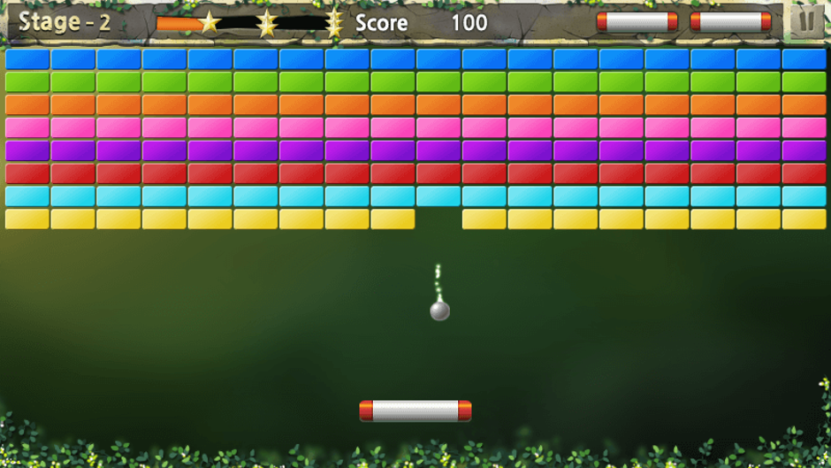
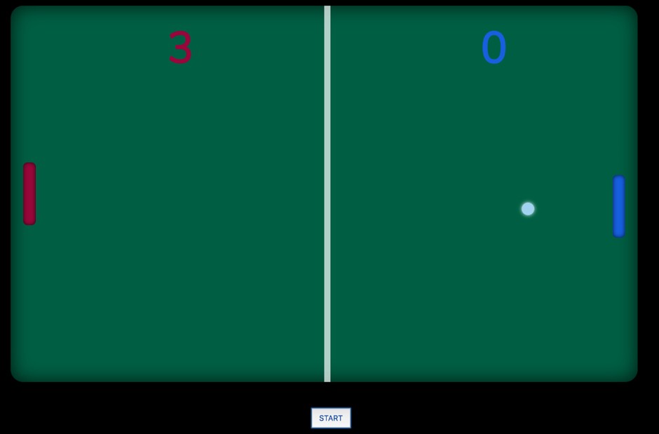

# BreakoutPong

        CS3305:
     Product Brief

    Arduino based game:
      Breakout Pong
 

Product Name:
Breakout Pong

Release Date:
06/03/2019

Product Description:
Our Arduino based game Breakout Pong is a single (fig. 1) and multi-player (fig. 2) game modelled after already existing popular games. The single player game is modelled after a popular game called Breakout and the multiplayer game is modelled after Pong.  The player/s will use the buttons connected to an Arduino via 1 breadboard per user and wires and resistors to play the game. It will integrate a user account system allowing users to create a profile, save and compare scores with other users amongst other services. 

Target Market:
Casual/advanced programmers that own/have access to an Arduino and components and have an interest in gaming 

Product differentiation:
Unlike other competitors our focus is to make it as easy as possible for users to install/operate our software. This stems from the fact that many Arduino users have little programming knowledge and many of the currently available Arduino code examples are difficult for beginners to install/use.

Product Impact:
Breakout pong will impact users by increasing their potential use of Arduino and expanding their view of what an Arduino is capable of

Fig. 1. Example of single player game

Fig. 2. Example of multi-player game
 

Product Demonstration Video
 
